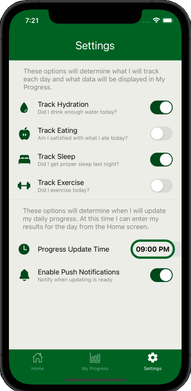
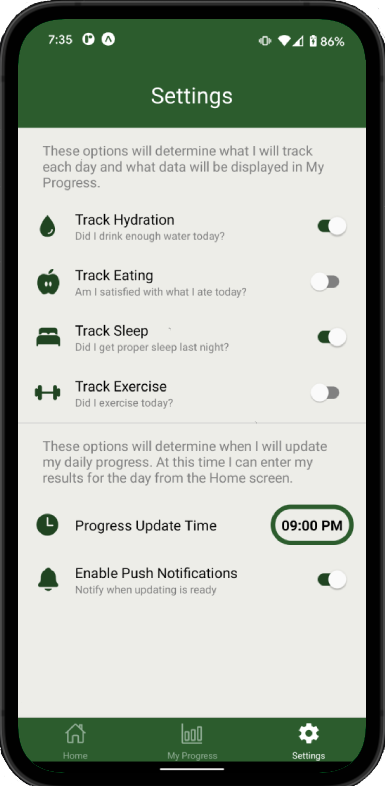

# Habitify Wellness
An app I developed to practice with React Native, Redux, and TypeScript. Habitify Wellness is a tool to track daily wellness goals such as proper hydration, exercise, sleep quality, and eating habits. This app does not focus on specific details (calorie counting, reps, etc.), but generally tracks if these goals were met or not. 

# Usage
On the **Settings** screen, select which categories of wellness will be tracked, select a time that entering data will become available, and enable push notifications to receive a reminder to input results at the scheduled time. 

On the **Progress** screen, view each day of the week's entries to see progress. Entries display if each goal was met or not through a colored row of icons and a simple checklist.

On the **Home** screen, the button on the bottom will become enabled when the scheduled time arrives, and the user can press it to enter their results and submit for the day.

&nbsp;&nbsp;&nbsp;&nbsp;&nbsp;&nbsp;

# iOS and Android Views

&nbsp;&nbsp;&nbsp;&nbsp;&nbsp;&nbsp;
